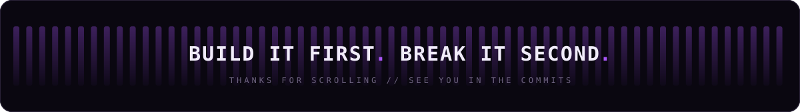

  

  
  
  
  

  

## `>_` the mission

I don't want to be a one-stack coder. I want to understand **every layer**:
how electrons become logic gates, how gates become a CPU, how machine code
becomes an operating system, and how all of that ends up as apps and AI
running on any device: phone, desktop, embedded, server.

**Build it first. Break it second.** Reverse engineering comes after I can
build the thing myself.

  

## `>_` things i built

  
  
  

## `>_` toolbox

   
   
  

## `>_` activity

  <picture>
    <source media="(prefers-color-scheme: dark)" srcset="https://raw.githubusercontent.com/YepSultan/YepSultan/output/snake-dark.svg">
    <source media="(prefers-color-scheme: light)" srcset="https://raw.githubusercontent.com/YepSultan/YepSultan/output/snake-light.svg">
    
  </picture>

  

